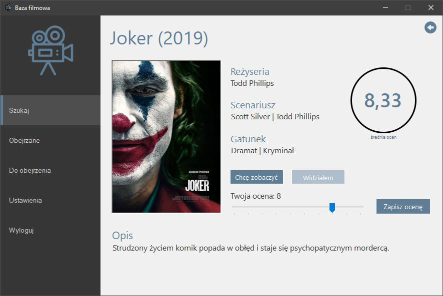
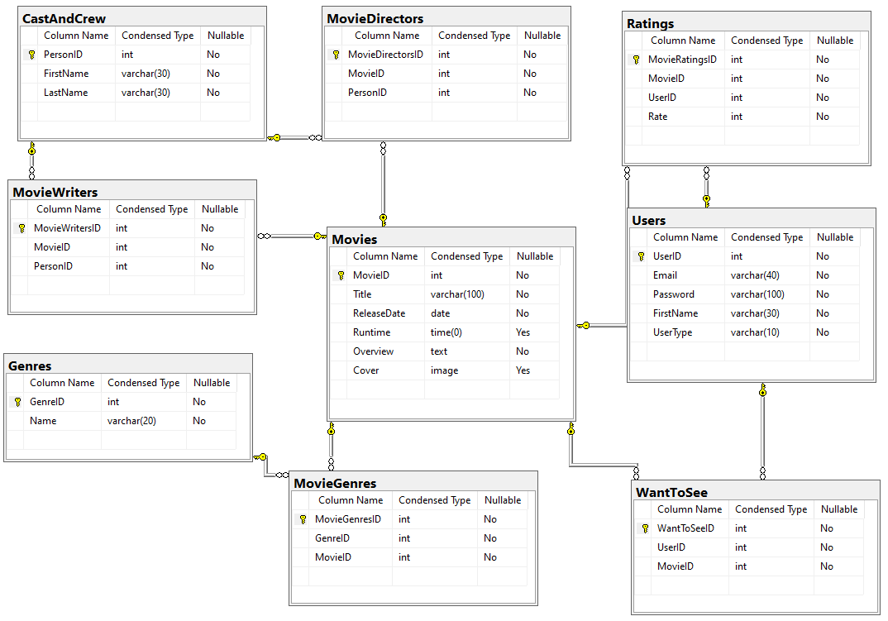

# Movies Database

## Table of contents
* [General info](#general-info)
* [Technologies](#technologies)
* [Features](#features)
* [Database](#database)
* [Setup](#setup)

## General info
Desktop app for managing movies database.
	
  
## Technologies
Project was created with:
* C#
* Windows Forms
* LINQ to SQL
* Transact-SQL

## Features
* manage movie rates
* keep track of movies you want to see
* search for new movies to watch

## Database

## Setup
To run this project, install it using setup file located in Setup folder.
Requirements: Microsoft .NET Framework 4.7.2
